# Comparative Evaluation of Sentinel-1, Sentinel-2, and Fused Time Series for Agricultural Field Boundary Delineation Using Deep Learning

**Author:** Sushant Aryal · UCLouvain · Faculté des bioingénieurs · Earth and Life Institute
**Supervisors:** Prof. Pierre Defourny, Quentin Deffense
**Jury:** Dr. Julien Radoux (UCLouvain), Jean Bouchat (ESA)
**Full Thesis:** [Google Drive link](https://drive.google.com/file/d/1OhbsXjZtZao2_TkUJaljjiepUkkJQTtH/view?usp=drive_link)

---

## Research at a Glance

This thesis evaluates Sentinel-1 SAR, Sentinel-2 optical, and fused Sentinel-1/2 time series for **agricultural field boundary delineation** across Wallonia, Belgium, over the 2018–2021 period. A **3D Vision Transformer** architecture with cross-modal attention is adapted to ingest cloud-contaminated optical and multi-orbit SAR time series directly, without prior cloud-free compositing. Five sensor configurations are compared against the Wallonia LPIS reference.

---

## Study Area

Wallonia (~16,844 km²) has a temperate oceanic climate with persistent cloud cover. Agriculture covers ~45% of the land area, ranging from large consolidated parcels in Hesbaye to fragmented fields in the Ardennes.

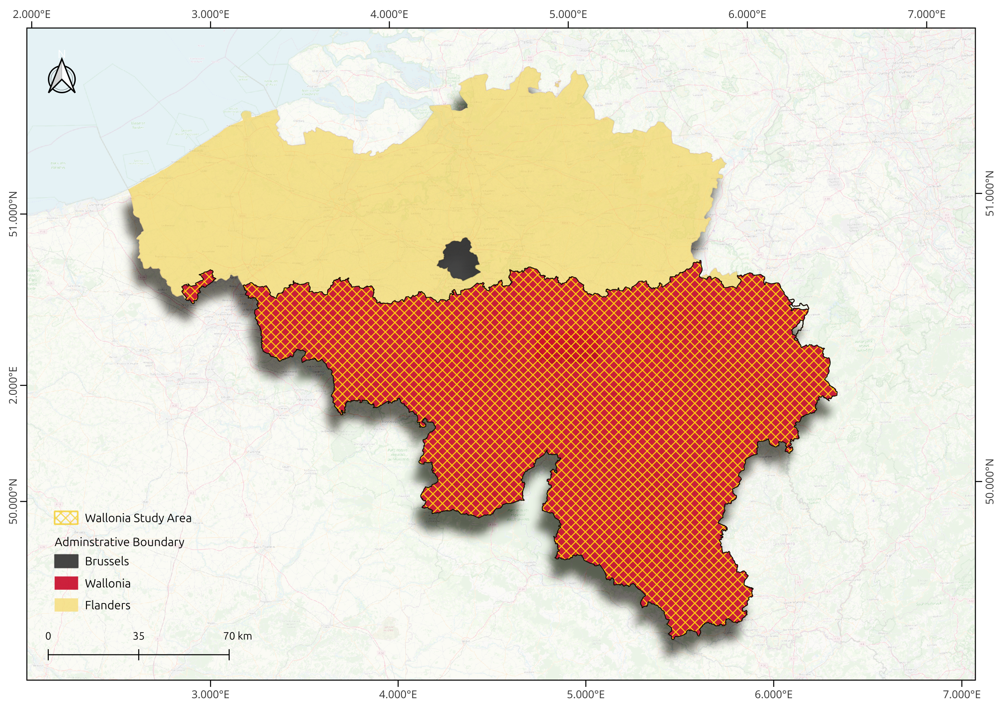

---

## Data & Labels

| Source | Details |
|---|---|
| **Sentinel-2** | 4,412 Level-2A acquisitions across 8 MGRS tiles; bands B2, B3, B4, B8 at 10 m; FMask scene-level quality filtering |
| **Sentinel-1** | 1,218 ascending + 1,526 descending acquisitions; VV backscatter and 6-day interferometric coherence (SLC) |
| **Reference** | Parcellaire Agricole Anonyme (LPIS) annual editions 2018–2021, ~340k declared parcels per year. Multi-task labels (field extent, boundary, normalised distance-to-boundary) derived per Waldner & Diakogiannis (2020) |

### Sentinel-2 Data Preparation

Sentinel-2 datacubes (4 bands × 10 dates × 128×128 pixels) were assembled per chip, including cloud-affected acquisitions to test the model's robustness to contamination.

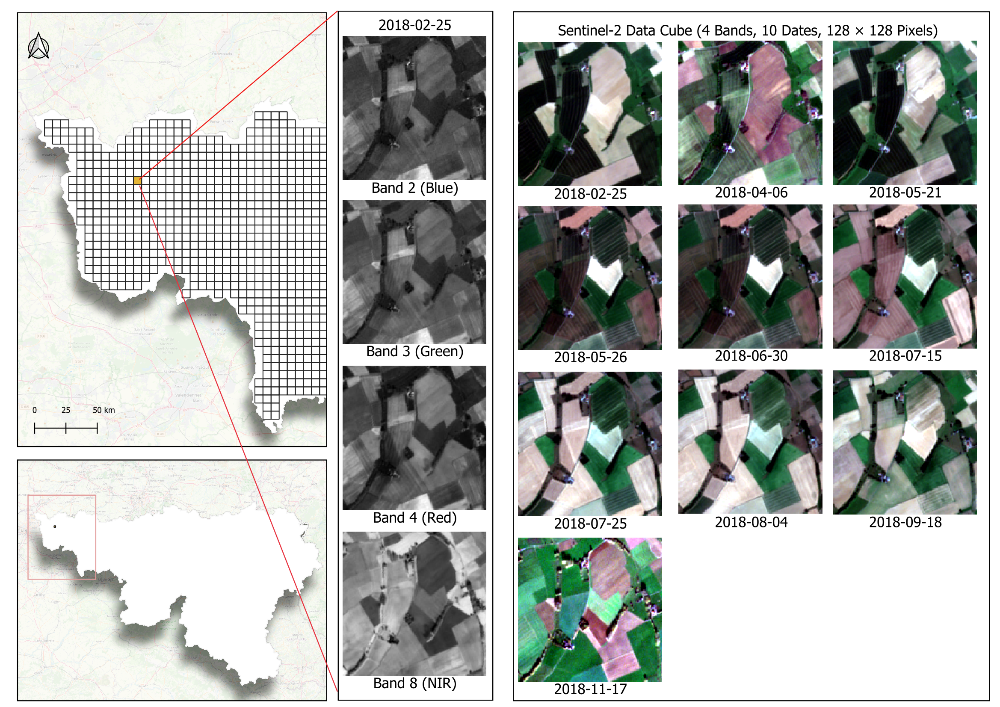

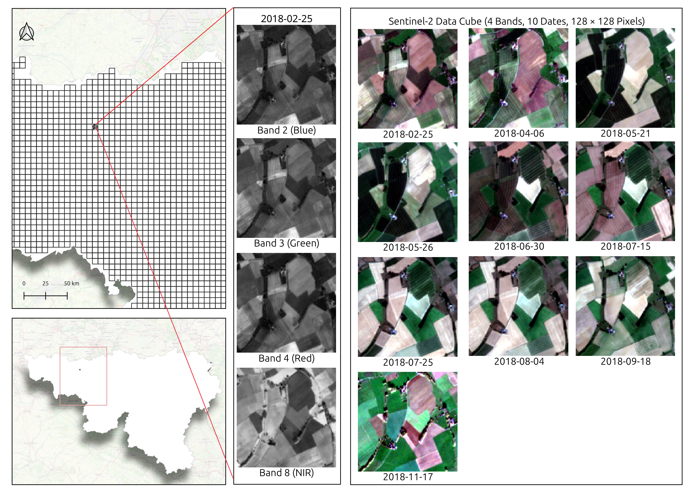

Scenes with heavy cloud cover (e.g. 2018-03-14) were retained rather than discarded, relying on temporal attention to recover usable signal:

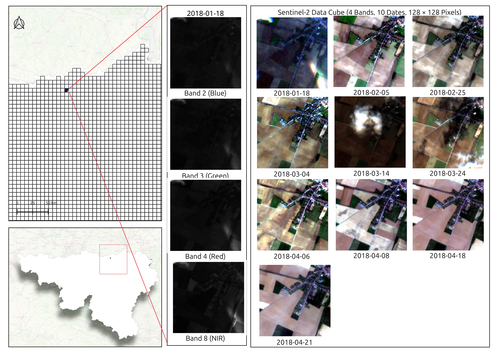

### Sentinel-1 Data Preparation

Sentinel-1 chips combine VV backscatter and 6-day interferometric coherence, for both ascending and descending orbits.

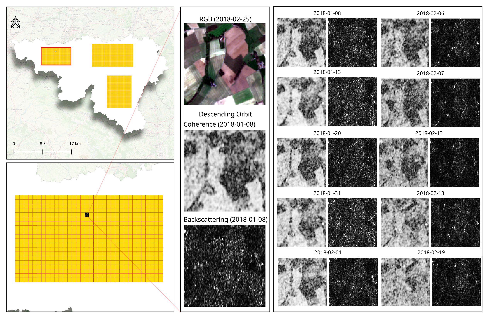

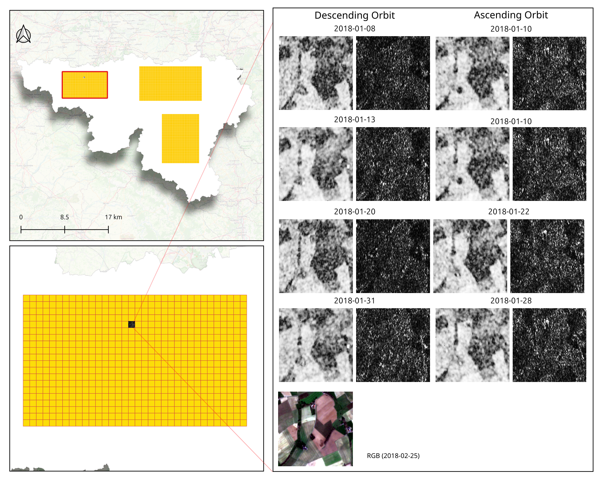

### Sentinel-1 / Sentinel-2 Combination

For the fusion configuration, coherence, backscatter, and RGB triplets are aligned in time to feed the dual-input model.

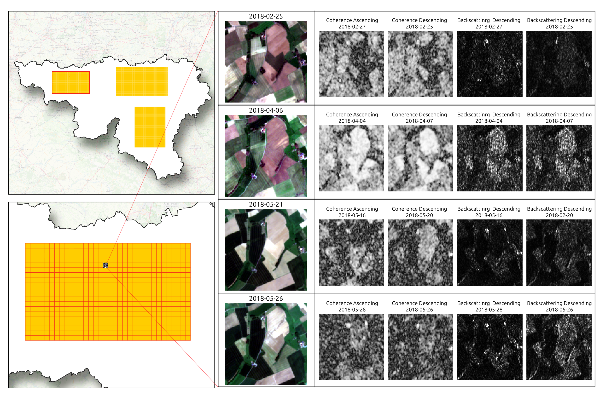

---

## Methodology

Data is organised into time-series datacubes of shape `(T, C, 128, 128)` and stored as HDF5/Zarr archives. The model uses a single- or dual-input **PTAViT3D U-Net**: an encoder–decoder with skip connections, attention computed jointly across spatial and temporal dimensions, and three output heads (extent, boundary, distance). For fusion, a sequential cross-attention mechanism allows the S1 and S2 streams to exchange features at every encoder stage.

**Train years:** 2018, 2019, 2021 — **Test year (held out):** 2020

### Feature Importance (Sentinel-1)

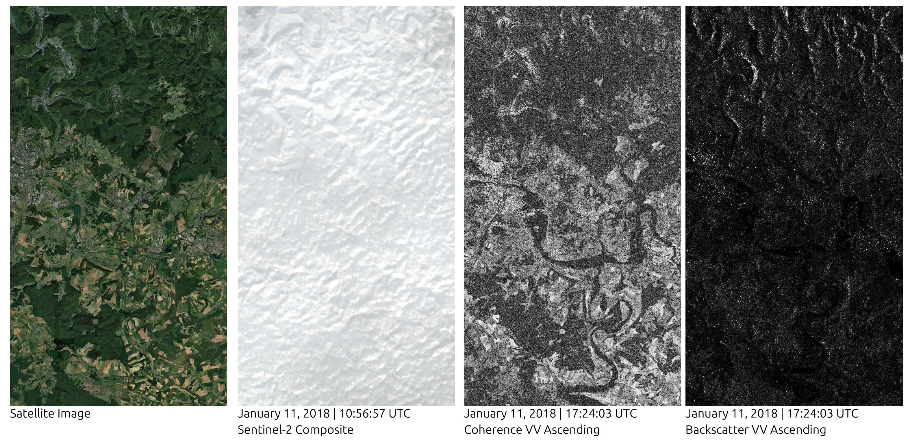

---

## Key Results (2020 Wallonia Test Set, ~10,000 chips)

Performance reported as Matthews Correlation Coefficient (MCC) for the extent and boundary segmentation tasks, and Intersection-over-Union (IoU) for extent.

| Configuration | Extent MCC | Boundary MCC | Extent IoU |
|---|---|---|---|
| **Sentinel-2 cloud-free** | **0.919** | **0.695** | **0.921** |
| Sentinel-2 cloud < 50% | 0.908 | 0.657 | 0.911 |
| Sentinel-1 (coherence + backscatter, dual orbit) | 0.852 | 0.509 | 0.868 |
| Sentinel-1 (coherence only) | 0.757 | 0.390 | 0.783 |
| Fused S1 + S2 (cloud < 50%) | 0.893 | 0.628 | 0.917 |

### Findings

- **Sentinel-2 cloud-free** leads on both tasks.
- The **cloud < 50%** configuration loses only 0.011 MCC on extent, confirming that temporal attention recovers usable signal from partially cloud-affected acquisitions without explicit masking.
- **Sentinel-1 coherence alone** is sufficient for extent detection (MCC 0.757) but weak on boundary localisation.
- Combining **coherence with backscatter and dual-orbit acquisitions** delivers the largest SAR-only gain.
- **SAR–optical fusion does not surpass** the optical-only baseline in this configuration.

---

## Prediction Maps

Prediction map generated using the **Sentinel-2** configuration:

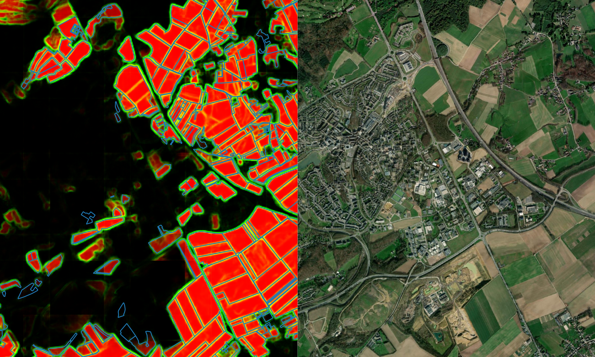

Prediction map generated using the **fused Sentinel-1 + Sentinel-2** configuration:

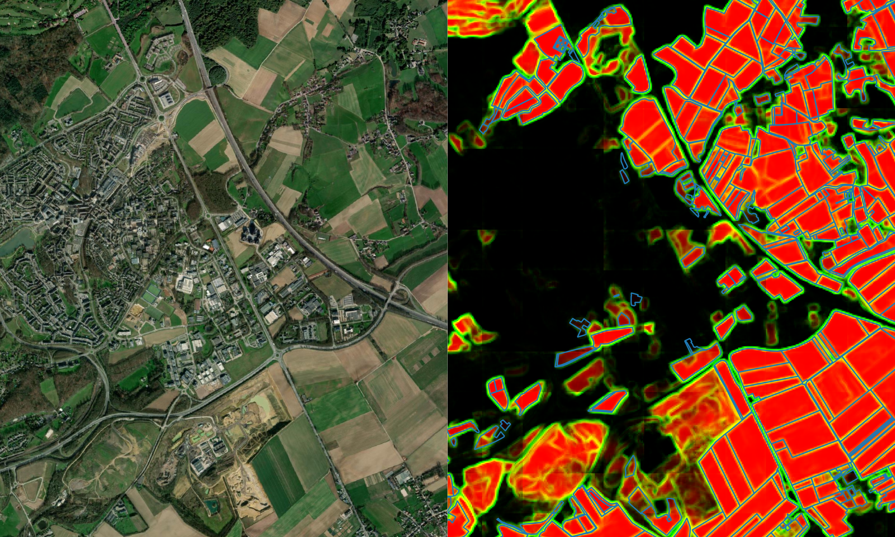

### Post-Processed / Polygonized Output

Raw segmentation outputs were polygonized and compared against the Ground Truth LPIS reference (correct detections, incorrect detections, and omissions):

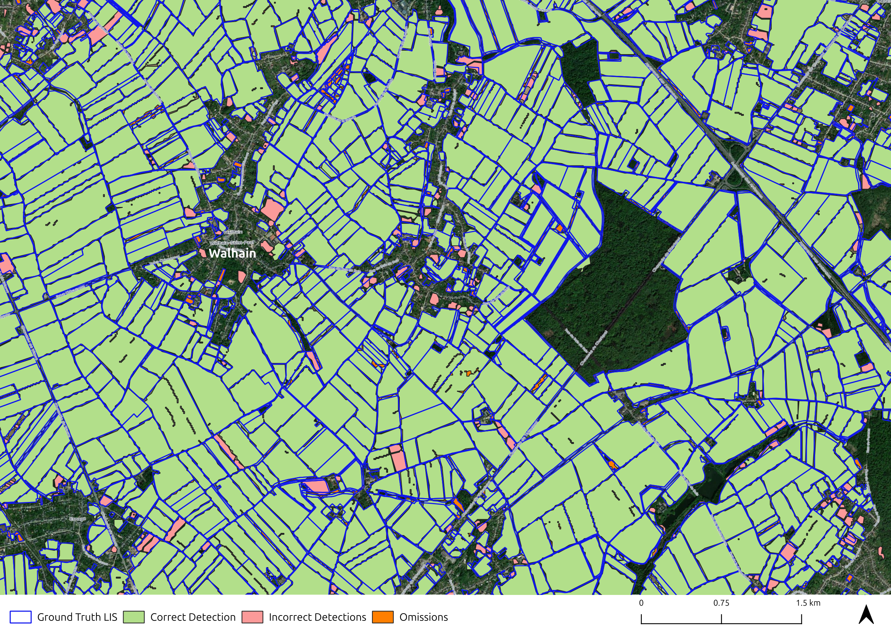

---

## Repository Structure

```
Master-Thesis/
├── Data Preperation/          # Scripts for building S1/S2 datacubes
├── Deep Learning Model Script/# PTAViT3D U-Net model, training & fusion code
├── Post Processing/           # Polygonization & accuracy assessment scripts
└── Images/                    # Figures used in this README and thesis summary
```

---

## Citation

If you use this work, please cite:

> Aryal, S. (2026). *Comparative Evaluation of Sentinel-1, Sentinel-2, and Fused Time Series for Agricultural Field Boundary Delineation Using Deep Learning.* MSc Thesis, UCLouvain, Earth and Life Institute.

---

## Acknowledgements

Supervised by Prof. Pierre Defourny and Quentin Deffense (UCLouvain), with jury members Dr. Julien Radoux (UCLouvain) and Jean Bouchat (ESA).
